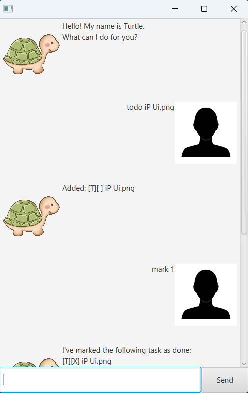

# Turtle User Guide

Turtle is a JavaFX task management chatbot.
It helps you keep track of todos, deadlines, and events using simple text-based commands.

## Quick Start

1. Launch the app.
2. Type a command in the input box.
3. Press Enter to execute.

## Command List

- `todo <task_name>`
- `deadline <task_name> /by <deadline>`
- `event <task_name> /from <from_date> /to <to_date>`
- `list [sort]`
- `mark <index>`
- `unmark <index>`
- `delete <index>`
- `find <search_str>`
- `bye`

**Remarks**
> - `<...>` indicates a mandatory field, while `[...]` indicates an optional field.
> - Date fields (e.g. `<deadline>`, `<from_date>`, `<to_date>`) must use `yyyy-mm-dd` format (e.g. `2026-02-14`).
> - Task indexes are 1-based, matching the indexing shown by `list`.

## Features

### Add Todo

Adds a todo task.

Syntax: `todo <task_name>`

Example: `todo read book`

### Add Deadline

Adds a deadline task.

Syntax: `deadline <task_name> /by <deadline>`

Example: `deadline submit iP /by 2026-02-20`

### Add Event

Adds an event task with start and end dates.

Syntax: `event <task_name> /from <from_date> /to <to_date>`

Example: `event hackathon /from 2026-03-01 /to 2026-03-03`

### List Tasks

Shows all tasks.

Syntax: `list [sort]`

Use `list` to show tasks by creation order.

Use `list sort` to show tasks by completion status (incomplete first), then by name.

### Mark Task

Marks a task as done.

Syntax: `mark <index>`

Example: `mark 2`

### Unmark Task

Marks a task as not done.

Syntax: `unmark <index>`

Example: `unmark 2`

### Delete Task

Deletes a task.

Syntax: `delete <index>`

Example: `delete 3`

### Find Tasks

Finds tasks that contain the given search text.

Syntax: `find <search_str>`

Example: `find submit`

### Exit

Closes Turtle.

Syntax: `bye`
